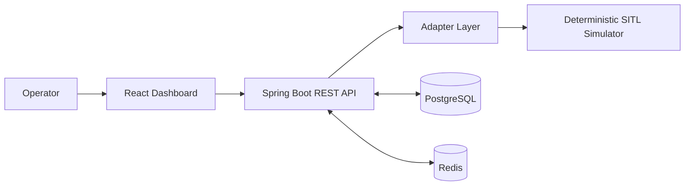
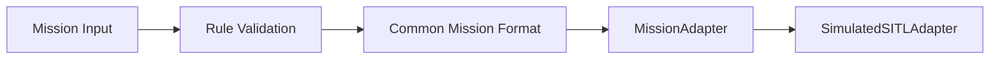
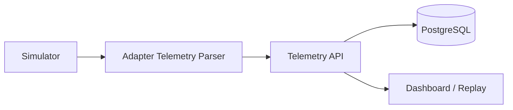
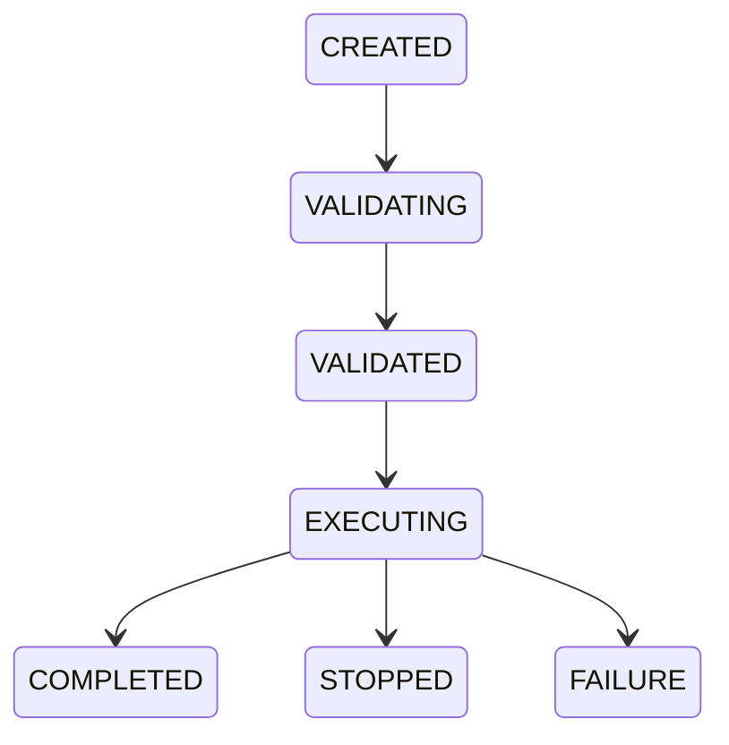
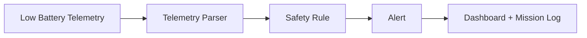

# Astra Command Architecture

## High-Level Architecture

## Command Flow

## Telemetry Flow

## Mission Lifecycle

## Failure Flow

The frontend never controls the simulator directly and never connects to PostgreSQL. It talks only to the Spring Boot API. The adapter translates the common Astra mission/telemetry model into the deterministic simulator protocol.
